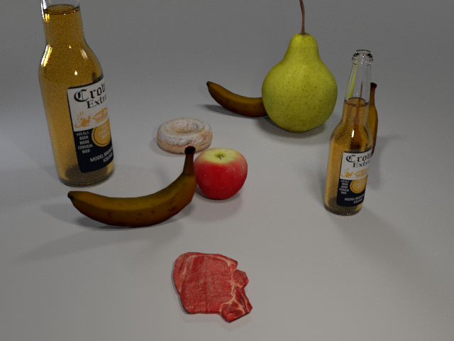

# FRIDGR Dataset Generation

This is the code used to generate the **FRIDGR** dataset:

**[Smart Home Appliances: Chat with Your Fridge](https://arxiv.org/pdf/1912.?????.pdf)**

This project forks [CLEVR](https://cs.stanford.edu/people/jcjohns/clevr/) project and modifies it for *smart fridge* application. You can use this code to render synthetic images and compositional questions for those images, like this:

<div align="center">
  
</div>

**Q:** How many beer bottles? <br>
**A:** 2

**Q:** Do I have steak? <br>
**A:** Yes

**Q:** How many fruits? <br>
**A:** 5

**Q:** Is there spoiled bananas? <br>
**A:** Yes

**Q:** How many spoiled bananas? <br>
**A:** 3

All code was developed and tested on Ubuntu 16.04.

## Step 1: Generating Images
First we render synthetic images using [Blender](https://www.blender.org/), outputting both rendered images as well as a JSON file containing ground-truth scene information for each image.

You can then render some images like this:

```bash
cd image_generation
blender --background --python fridgr_render_images.py -- --num_images 10
```

If you have an NVIDIA GPU with CUDA installed then you can use the GPU to accelerate rendering like this:

```bash
blender --background --python fridgr_render_images.py -- --num_images 10 --use_gpu 1
```

The file `fridgr-output/FRIDGR_scenes.json` will contain ground-truth scene information for all newly rendered images.

You can find [more details about image rendering here](image_generation/README.md).

## Step 2: Generating Questions
Next we generate questions, functional programs, and answers for the rendered images generated in the previous step.
This step takes as input the single JSON file containing all ground-truth scene information, and outputs a JSON file 
containing questions, answers, and functional programs for the questions in a single JSON file.

You can generate questions like this:

```bash
cd question_generation
python3 fridgr_generate_questions.py
```

The file `fridgr-output/FRIDGR_questions.json` will then contain questions for the generated images.

You can [find more details about question generation here](question_generation/README.md).

## GPU support for older versions (not needed with new Blender):
sudo gedit `/usr/share/blender/scripts/addons/cycles/kernel/util_half.h`
comment out `typedef unsigned short half;`
add line `#include "cuda_fp16.h"`
run as CUDA_VISIBLE_DEVICES=N, blender ....

## FRDGR image dataset generation:

```bash
CUDA_VISIBLE_DEVICES=0, blender --background --python fridgr_render_images.py -- --start_idx 0 --num_images 60000 --max_objects 6 --use_gpu 1 --split train --output_image_dir ../fridgr-train/images/ --output_scene_dir ../fridgr-train/scenes/ --output_scene_file ../fridgr-train/FRIDGR_scenes.json

CUDA_VISIBLE_DEVICES=1, blender --background --python fridgr_render_images.py -- --start_idx 0 --num_images 10000 --max_objects 6 --use_gpu 1 --split val --output_image_dir ../fridgr-val/images/ --output_scene_dir ../fridgr-val/scenes/ --output_scene_file ../fridgr-val/FRIDGR_val_scenes.json

CUDA_VISIBLE_DEVICES=2, blender --background --python fridgr_render_images.py -- --start_idx 0 --num_images 10000 --max_objects 6 --use_gpu 1 --split test --output_image_dir ../fridgr-test/images/ --output_scene_dir ../fridgr-test/scenes/ --output_scene_file ../fridgr-test/FRIDGR_test_scenes.json
```

## FRDGR QA dataset generation:

```bash
python3 fridgr_generate_questions.py --input_scene_file ../fridgr-train/FRIDGR_train_scenes.json --output_questions_file ../fridgr-train/FRIDGR_train_questions.json

python3 fridgr_generate_questions.py --input_scene_file ../fridgr-val/FRIDGR_val_scenes.json --output_questions_file ../fridgr-val/FRIDGR_val_questions.json

python3 fridgr_generate_questions.py --input_scene_file ../fridgr-test/FRIDGR_test_scenes.json --output_questions_file ../fridgr-test/FRIDGR_test_questions.json
```

### Important: how to fix GiHub question format:

```bash
python3 question_generation/fix_github_questions.py --input_questions_file ./FRIDGR_v0.1/data/FRIDGR_train_questions.json --output_questions_file ./FRIDGR_v0.1/data/FRIDGR_fixed_train_questions.json

python3 question_generation/fix_github_questions.py --input_questions_file ./FRIDGR_v0.1/data/FRIDGR_val_questions.json   --output_questions_file ./FRIDGR_v0.1/data/FRIDGR_fixed_val_questions.json

python3 question_generation/fix_github_questions.py --input_questions_file ./FRIDGR_v0.1/data/FRIDGR_test_questions.json  --output_questions_file ./FRIDGR_v0.1/data/FRIDGR_fixed_test_questions.json
```
